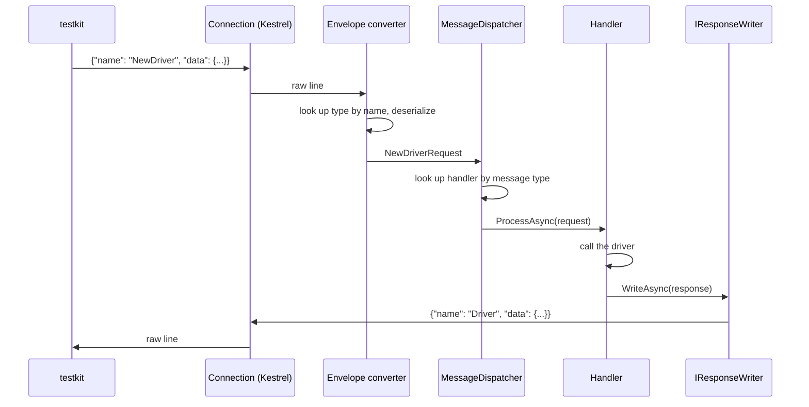
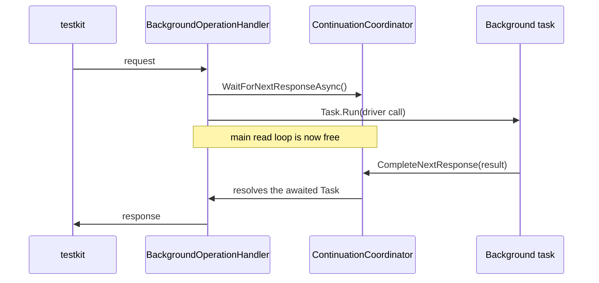

# Neo4j.Driver.TestKitBackend

This project implements the protocol used by [testkit](https://github.com/neo4j/testkit) to drive the .NET driver from the outside.
Testkit opens a TCP connection to the backend for each test.
Over that connection, it sends JSON requests describing driver operations to perform, such as opening a driver, running a query, or committing a transaction.
It then asserts on the responses.
The backend's task is to translate each request into a real driver call, and to translate the result into a response that reflects the driver's actual behaviour as closely as possible.

There is no separate protocol specification document.
The [testkit](https://github.com/neo4j/testkit) repository itself is the source of truth: `nutkit/protocol/*.py` defines the exact shape of every message, and `tests/stub/` defines the expected behaviour.
Where this README and testkit's own source disagree, testkit wins.

This document is written to help you make a change: what file to add, which convention to follow, and what to check before calling it done.
It explains the underlying design only as far as making a correct change requires; the rest lives in commit history and design discussion, not here.

A legacy implementation of this backend exists at `Neo4j.Driver.Tests.TestBackend.Legacy`.
It is retained only as a reference for prior behaviour, and should not be extended further.
Do not add new features there.

## Running the backend

The backend takes no command-line arguments.
Configuration comes entirely from `appsettings*.json` and the `ASPNETCORE_ENVIRONMENT` variable, which also selects the logging sink:

- `dev` logs to the console.
- `ci` logs to the console with the test name attached to each line, used by the `testkit/Dockerfile` build.
  Testkit captures the container's stdout into `artifacts/driver_backend/out.log`, which is what CI collects.

```bash
dotnet publish Neo4j.Driver/Neo4j.Driver.TestKitBackend/Neo4j.Driver.TestKitBackend.csproj \
  --configuration CI --output ./bin/Publish
ASPNETCORE_ENVIRONMENT=dev dotnet bin/Publish/Neo4j.Driver.TestKitBackend.dll
```

It listens on `0.0.0.0:9876` by default (also configurable via `appsettings.json`).

## Architecture

Each connection is given its own dependency-injection scope, resolved from an Autofac container.
Testkit opens one connection per test, so a DI scope corresponds exactly to a test.
Drivers, sessions, and any other object a test creates are disposed of automatically when the connection closes, so no state can leak from one test into another through shared references.
The one exception is the driver's clock, which is a process-wide static; see [The fake clock](#the-fake-clock-and-other-process-global-state) below.

The following diagram illustrates the path of a single request through the backend:



The design rests on the following pieces:

- **One file per message.**
  A message is a plain record implementing `IProtocolMessage`.
  A handler is a class deriving from `MessageHandler<TRequest>`.
  The request record, the response record, and the handler all live together in one file under `Messages/`.
  There is no separate DTO layer and no hand-written converter: the public properties of the record are exactly what testkit sends or receives.
- **Dispatch is a dictionary lookup, not reflection.**
  `MessageDispatcher` resolves handlers through Autofac's `IIndex<Type, IMessageHandler>`, keyed by each handler's `IMessageHandler<T>` type argument at registration time.
  There is no `MakeGenericType` call and no `MethodInfo.Invoke` on the hot path.
- **Responses are produced through `IResponseWriter`.**
  A handler does not return its response; instead, it writes the response directly (`await _responseWriter.WriteAsync(new SomeResponse(...))`).
  This design allows a single handler to send zero, one, or many response frames, which is what the result-streaming and callback flows described below depend on.
- **Handler registration follows a convention rather than explicit configuration.**
  `BackendModule` scans the assembly for concrete, non-generic, non-nested classes and registers each one with Autofac, keying any class that implements `IMessageHandler` by its message type.
  Adding a new message therefore means adding a file, not editing a registration list.
  Message records themselves are excluded from this scan, since they represent data rather than services.
- **Every message shares one envelope shape.**
  Everything sent to or received from testkit takes the form `{"name": "<Type>", "data": {...}}`.
  For an incoming request, the name is looked up in a name-to-type map built by reflection.
  For an outgoing response, the type name has its `Request` or `Response` suffix stripped to produce the name testkit expects; for example, `DriverResponse` becomes `"Driver"`, which also avoids any collision with the driver's own `Driver` type.
- **Handles are resolved during deserialization, not by hand.**
  A request property of type `Stored<IDriver>` resolves its driver from the per-connection object store while the request is being deserialized, so the handler only needs to read `.Object`.
  Responses work in the opposite direction: they carry a plain `string Id` copied from the handle, since an outgoing message never needs the live object itself.
  See [The object store](#the-object-store) below.
- **`Optional<T>` exists for the rare field where absence, a present null, and a present value are three distinct meanings**, as with `timeout` and `trustedCertificates`.
  Everywhere else, absence collapses to null, so a plain `T?` is the correct and simpler choice.

## The object store

Every object a test creates through the backend, a driver, a session, a transaction, a result, a manager, a stored error, needs to be referred to by later requests without serializing the object itself.
The object store (`IObjectStore`) exists to solve this, and understanding it is one of the more important parts of implementing this protocol.

`IObjectStore.Store<T>(T obj)` stores an object and returns a `Stored<T>` pairing a freshly generated string id with the object.
A second overload, `Store<T>(Func<string, T> create)`, exists for objects that need to know their own id while they are still being constructed.
A bookmark manager is the clearest example: its supplier and consumer callbacks must reference the manager's own id, so the manager is built inside the factory function the id is generated for.
`IObjectStore.Get<T>(string id)` looks an object up by id, throwing `TestKitProtocolException` if the id is unknown or resolves to an object of the wrong type.

Most handlers never call `Get` directly.
A request property declared as `Stored<T>` is resolved automatically during deserialization, and the naming follows one fixed rule: `JsonOptionsProvider.BindHandlesToIdMembers` appends `Id` to the camelCased property name to get the field it reads from testkit's request.
A property `Stored<IDriver> Driver` therefore reads its id from the field `driverId`, calls `IObjectStore.Get<IDriver>` with that id, and hands the handler an already-resolved object; the handler never sees the id itself unless it also asks for it through `.Id`.
Calling `Get` directly is reserved for the few cases where an id arrives as a plain string rather than through that property-based resolution, such as `RetryableNegative` looking up a stored error by `ErrorId`.

The store is scoped to the connection, so it is disposed automatically when a test's connection closes.
Disposal walks every stored object in reverse storage order and disposes anything implementing `IAsyncDisposable` or `IDisposable`.
This is what actually releases drivers, sessions, and other resources at the end of a test.
Explicit close handlers such as `DriverClose` exist to satisfy testkit's protocol, not to perform the underlying cleanup.

## Adding a new message handler

`Messages/CheckMultiDBSupport.cs` and `Messages/SessionLastBookmarks.cs` are good starting templates.
Both are fully self-contained (the request, the response, and the handler all live in one file, with nothing borrowed from elsewhere), and each resolves an existing handle, reads something off the object behind it, and responds:

```csharp
internal record CheckMultiDBSupportRequest(Stored<IDriver> Driver) : IProtocolMessage;

internal record MultiDBSupportResponse(string Id, bool Available) : IProtocolMessage;

internal class CheckMultiDBSupportHandler : MessageHandler<CheckMultiDBSupportRequest>
{
    private readonly IResponseWriter _responseWriter;

    public CheckMultiDBSupportHandler(IResponseWriter responseWriter)
    {
        _responseWriter = responseWriter;
    }

    public override async Task ProcessAsync(CheckMultiDBSupportRequest message)
    {
        var available = await message.Driver.Object.SupportsMultiDbAsync();
        await _responseWriter.WriteAsync(new MultiDBSupportResponse(message.Driver.Id, available));
    }
}
```

```csharp
internal record SessionLastBookmarksRequest(Stored<IAsyncSession> Session) : IProtocolMessage;

internal record BookmarksResponse(string[] Bookmarks) : IProtocolMessage;

internal class SessionLastBookmarksHandler : MessageHandler<SessionLastBookmarksRequest>
{
    private readonly IResponseWriter _responseWriter;

    public SessionLastBookmarksHandler(IResponseWriter responseWriter)
    {
        _responseWriter = responseWriter;
    }

    public override async Task ProcessAsync(SessionLastBookmarksRequest message)
    {
        var bookmarks = message.Session.Object.LastBookmarks.Values;
        await _responseWriter.WriteAsync(new BookmarksResponse(bookmarks));
    }
}
```

The second one reads a property directly instead of awaiting a driver call, and resolves a `Stored<IAsyncSession>` instead of a `Stored<IDriver>`: the pattern is the same regardless of which stored type or which kind of driver access is involved.
No registration step, no envelope wiring, and no manual name mapping are required beyond declaring the `Stored<T>` property; once the file exists and the project builds, testkit can send the request and get the response back.

Both examples resolve an existing handle rather than creating one.
For a message that creates a driver object and stores it, see `Messages/NewDriver.cs`:

```csharp
public override async Task ProcessAsync(NewDriverRequest message)
{
    var driver = GraphDatabase.Driver(message.Uri, ..., Configure);
    var stored = _objectStore.Store(driver);
    await _responseWriter.WriteAsync(new DriverResponse(stored.Id));
}
```

Before considering a new handler complete, verify the following:

- If the request needs a handle to an existing object, such as a driver or a session, declare that property as `Stored<T>` rather than a bare `string` identifier.
  The conversion is then handled automatically.
- If a field must distinguish an absent value from a present null value, use `Optional<T>`.
  Otherwise, use `T?`.
- If the message is part of a flow that already has an established shape, such as a callback or a retryable transaction, consult the relevant section below before introducing a new pattern.
- Add a unit test under `Neo4j.Driver.TestKitBackend.Tests` for any handler logic beyond a straight pass-through.
  Verify the change against a real testkit stub test as well (see [Verifying a change](#verifying-a-change)) before considering it complete.
  A passing unit test suite alone has previously missed genuine format bugs, because it asserts against the mapper's C# output rather than the JSON actually sent to testkit.

## Callback and multi-response flows

Some operations do not take the form of a single request and a single response.
A bookmark manager, an auth token provider, and a custom address resolver all follow the same pattern: the driver calls into backend code mid-operation, the backend must ask testkit for an answer over the same connection, and the original driver call resumes once testkit replies.
Retryable transactions follow a related shape: `SessionReadTransaction` and `SessionWriteTransaction` return control to testkit, which later sends `RetryablePositive` or `RetryableNegative` to report the outcome of the retry attempt.

Two primitives implement these flows.
Which one applies depends on where the driver call actually runs.

**`ICallbackExchanger` is for driver callbacks that can block their calling thread while waiting for a reply.**
Its `SendAsync<TResponse>` method writes a callback request tagged with a freshly generated `RequestId`, then reads the next incoming line directly off the connection, rejecting it if its type or `RequestId` does not match what was expected.
A bookmark manager's supplier uses it this way:

```csharp
private async Task<string[]> SupplyBookmarksAsync(string managerId)
{
    var completion = await _callbackExchanger.SendAsync<BookmarksSupplierCompleted>(
        id => new BookmarksSupplierRequest(id, managerId));

    return completion.Bookmarks;
}
```

`BookmarksSupplierRequest` (`Messages/BookmarksSupplier.cs`) is what this sends to testkit, and `BookmarksSupplierCompleted` is the matching reply, correlated by `RequestId`.
Both records carry data only; `ICallbackExchanger` performs the actual waiting and matching.

**`IContinuationCoordinator` is for driver calls that run on a background task, leaving the connection's main read loop free to accept the next request.**
`BackgroundOperationHandler<T>` is the base class that arranges this.
It starts the driver operation with `Task.Run`, and immediately awaits `WaitForNextResponseAsync()` so the connection can accept whatever testkit sends next.
When the background operation finishes, it calls `CompleteNextResponse` with the result, which is what the earlier `await` resolves to, and which is then written back to testkit as the response.



A minimal subclass only has to implement `ExecuteAsync`, returning the response to send back or throwing on failure.
This example is illustrative rather than a real file (the only current subclass is the retryable transaction handler below, which layers extra machinery on top), but it shows the shape any new one would take:

```csharp
internal class SlowLookupHandler : BackgroundOperationHandler<SlowLookupRequest>
{
    public SlowLookupHandler(
        IContinuationCoordinator coordinator,
        IResponseWriter responseWriter,
        IDriverErrorMapper driverErrorMapper,
        ILogger logger)
        : base(coordinator, responseWriter, driverErrorMapper, logger)
    {
    }

    protected override async Task<IProtocolMessage> ExecuteAsync(SlowLookupRequest message)
    {
        var info = await message.Driver.Object.GetServerInfoAsync();

        // A normal return value here is enough: it becomes the response the base
        // class writes back. There is no need to catch exceptions from the driver
        // call above either, since the base class's background loop already catches
        // exceptions, and maps each to the right *ErrorResponse before writing it 
        // back. Only add a local catch if this handler needs to react to the failure
        // itself before it is reported to testkit.
        return new SlowLookupResponse(info.Address);
    }
}
```

The coordinator also exposes a second, unrelated pair of methods, `WaitForOutcomeAsync` and `CompleteOutcome`/`FailOutcome`, keyed by session id rather than by request.
These exist specifically for the retryable transaction flow.
`RetryablePositive` and `RetryableNegative` are themselves background operations, so they resolve through `WaitForNextResponseAsync`/`CompleteNextResponse` like any other; inside that background operation, they additionally call `CompleteOutcome` or `FailOutcome` to unblock the transaction body that is waiting on `WaitForOutcomeAsync` for that same session:

```csharp
public override async Task ProcessAsync(RetryablePositiveRequest message)
{
    var sessionId = message.Session.Id;
    var responseTask = _coordinator.WaitForNextResponseAsync();
    _coordinator.CompleteOutcome(sessionId);
    await _responseWriter.WriteAsync(await responseTask);
}
```

According to testkit's own protocol definitions, none of the `*Completed` callback replies, nor `RetryablePositive`, nor `RetryableNegative`, produces a response frame of its own.
When adding a new message to one of these flows, its handler should resolve a pending continuation instead of writing a response, and must not write one.

## Adding a type with its own envelope

A few values need the same `{"name": ..., "data": ...}` envelope as a message, without being a message themselves: `AuthorizationToken` and `ClientCertificate` are the current examples.
These implement `IWireType<T>`, a self-referential interface where `T` is the type itself:

```csharp
internal record ClientCertificate(
    string Certfile,
    string Keyfile,
    string? Password = null) : IWireType<ClientCertificate>;
```

The property that holds one has to be declared as `IWireType<ClientCertificate>`, not as `ClientCertificate` directly, so the generic converter recognises it and applies the envelope:

```csharp
public required IWireType<AuthorizationToken>? AuthorizationToken { get; init; }
```

The envelope name defaults to the type's own name, with any trailing `Request` or `Response` stripped by the same rule messages use.
Adding a new one of these means declaring the record as `IWireType<TheNewType>` and giving the containing property that same interface type; nothing else needs registering.

This differs from Cypher types, which share a single property across many possible shapes (`ICypherValue`) rather than each getting a dedicated property of its own, covered next.

## Cypher type mapping

Query parameters, on the incoming side, and record values, summary fields, and diagnostic records, on the outgoing side, all pass through the Cypher type envelope testkit expects, defined in `nutkit/protocol/cypher.py`, for example `{"name": "CypherInt", "data": {"value": 1}}`.
Each Cypher type is a record under `Cypher/` implementing `ICypherValue`.
Each direction of the mapping is a single exhaustive `switch` expression: `NativeToCypherMapper.Map(object?)` for outgoing values, and `CypherToNativeMapper.Map(ICypherValue)` for incoming values.
Adding a new Cypher type means adding a record and a case in both switch expressions; no separate lookup table needs to be updated.

## Verifying a change

Unit tests under `Neo4j.Driver.TestKitBackend.Tests` cover handler and mapper logic in isolation.
For any change that affects what is sent to or received from testkit, also run the relevant testkit stub test against a locally running backend.

1. Confirm the message shape directly in testkit's own `nutkit/protocol/requests.py` and `responses.py`; these files are the actual contract.
2. Locate a candidate test with `grep -rl "<frontend method>" tests/stub/` in the testkit repository.
   Examine what else that test exercises before selecting it, and prefer a test that requires only handlers that already exist.
3. Check the test's `required_features` against `GetFeaturesHandler.SupportedFeatures` (`Messages/GetFeatures.cs`).
   A missing flag causes the test to skip before it reaches the backend at all.
   Add the flag only once the backend genuinely supports the feature, and verify its exact spelling against `nutkit/protocol/feature.py`.
4. Publish and run the backend as described in [Running the backend](#running-the-backend).
   Then, from the testkit repository, run:

   ```bash
   export TEST_DRIVER_NAME=dotnet
   python3 -m unittest tests.stub.<module>.<file>.<TestClass>.<test_method> -v
   ```

Examine the result carefully.
A status of `skipped` usually indicates a missing feature flag rather than a backend defect.

## The fake clock and other process-global state

The driver's clock (`DateTimeProvider.StaticInstance`) is a process-wide static, making it the one piece of state that a per-connection DI scope cannot own.
`FakeTimeInstall`, `FakeTimeTick`, and `FakeTimeUninstall` patch and restore it directly.
An explicit uninstall-on-scope-disposal rule ensures that a test which crashes mid-patch cannot leave the clock frozen for the next test.
Everything that needs the clock communicates through a small clock-control interface rather than the static instance directly, so that the single place aware of the static patching remains easy to find, and easy to remove once the driver gains proper clock injection.

## Common pitfalls

These issues recur often enough, or fail silently enough, to warrant stating directly rather than leaving them to be rediscovered:

- Entries inside `RecordList.records` and `RecordOptional.record` are bare `{"values": [...]}` objects, skipping the full `Record` envelope entirely.
- A field can carry three distinct meanings depending on whether it is absent, present as `null`, or present with a value, as with `timeout`.
  Some fields, such as `trustedCertificates`, carry a fourth meaning by also distinguishing an empty list.
  These fields need `Optional<T>` to preserve every state; a plain `T?` collapses two of them together.
- `AuthTokenManagerClose` always responds using the name `AuthTokenManager`; testkit does not expect the `Close` suffix on the reply.
- Feature flag strings must match testkit's `Feature` enum exactly, since an unrecognised string aborts the whole test run, well beyond the single test that used it.
- Testkit treats a blank line on the socket outside a response frame as a crash.
  A log line on the same socket is fine as long as it is non-blank.
- Field names are camelCase everywhere except `utc_offset_s` and `timezone_id`, which testkit sends verbatim.
- `CypherFloat` encodes its non-finite values, `"+Infinity"`, `"-Infinity"`, and `"NaN"`, as JSON strings.
  `CypherBytes` and `CypherVector` use lowercase, space-separated hexadecimal.
- An empty `RetryableNegative.ErrorId` means there is nothing to look up, so respond with `FrontendError` directly.
- Testkit deserializes recursively by `name`.
  Reusing a protocol type name for a different shape, even in an unrelated message, will misdirect that deserialization.
- A failed request ends the connection: `BackendErrorResponse` goes out and the socket closes, with testkit opening a fresh connection for the next test.
  Per-request recovery is not part of the design. If an unexpected exception is thrown, the test fails.
