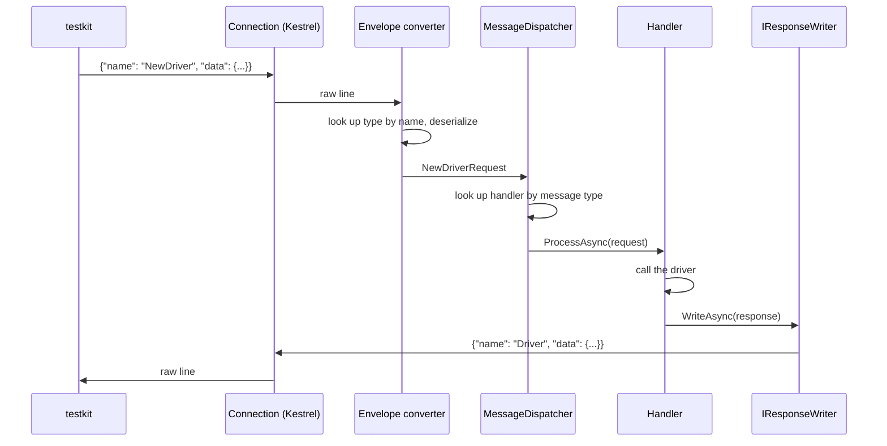

# Neo4j.Driver.TestKitBackend

This project implements the protocol used by [testkit](https://github.com/neo4j/testkit) to drive the .NET driver from the outside.
Testkit opens a TCP connection to the backend for each test.
Over that connection, it sends JSON requests describing driver operations to perform, such as opening a driver, running a query, or committing a transaction.
It then asserts on the responses.
The backend's task is to translate each request into a real driver call, and to translate the result into a response that reflects the driver's actual behaviour as closely as possible.

There is no separate protocol specification document.
The [testkit](https://github.com/neo4j/testkit) repository itself is the source of truth: `nutkit/protocol/*.py` defines the exact shape of every message, and `tests/stub/` defines the expected behaviour.
Where this README and testkit's own source disagree, testkit wins.

This document is written to help you make a change: what file to add, which convention to follow, and what to check before calling it done.

A legacy implementation of this backend exists at `Neo4j.Driver.Tests.TestBackend.Legacy`.
It is retained only as a reference for prior behaviour, and should not be extended further.
Do not add new features there.

## Running the backend

The backend takes no command-line arguments.
Configuration comes entirely from `appsettings*.json` and the `ASPNETCORE_ENVIRONMENT` variable, which also selects the logging sink:

- `dev` logs to the console.
- `ci` logs to the console with the test name attached to each line, used by the `testkit/Dockerfile` build.
  Testkit captures the container's stdout into `artifacts/driver_backend/out.log`, which is what CI collects.

```bash
dotnet publish Neo4j.Driver/Neo4j.Driver.TestKitBackend/Neo4j.Driver.TestKitBackend.csproj \
  --configuration CI --output ./bin/Publish
ASPNETCORE_ENVIRONMENT=dev dotnet bin/Publish/Neo4j.Driver.TestKitBackend.dll
```

It listens on `0.0.0.0:9876` by default (also configurable via `appsettings.json`).

## Architecture

Each connection is given its own dependency-injection scope, resolved from an Autofac container.
Testkit opens one connection per test, so a DI scope corresponds exactly to a test.
Drivers, sessions, and any other object a test creates are disposed of automatically when the connection closes, so no state can leak from one test into another through shared references.
The one exception is the driver's clock, which is a process-wide static; see [The fake clock](#the-fake-clock-and-other-process-global-state) below.

The following diagram illustrates the path of a single request through the backend:



The design rests on the following pieces:

- **One file per message.**
  A message is a plain record implementing `IProtocolMessage`.
  A handler is a class deriving from `MessageHandler<TRequest>`.
  The request record, the response record, and the handler all live together in one file under `Messages/`.
  There is no separate DTO layer and no hand-written converter: the public properties of the record are exactly what testkit sends or receives.
- **The read loop dispatches every message on its own task.**
  The connection's read loop reads continuously; each incoming message is dispatched to its handler on a task of its own, so a handler that is still awaiting something never blocks the next message from being read and dispatched.
  This is what allows a handler to wait, mid-method, for a message that has not arrived yet; see [Handlers that await a reply from testkit](#handlers-that-await-a-reply-from-testkit).
- **Error classification lives in the read loop, not in handlers.**
  A handler lets exceptions propagate.
  The loop catches whatever a handler throws and writes the correct error frame: `FrontendException` becomes `FrontendError`, an exception originating in the driver becomes `DriverError`, and anything else becomes `BackendError`.
  A handler only catches an exception when it needs to react to the failure itself.
- **Dispatch is a dictionary lookup, not reflection.**
  `MessageDispatcher` resolves handlers through Autofac's `IIndex<Type, IMessageHandler>`, keyed by each handler's `IMessageHandler<T>` type argument at registration time.
  There is no `MakeGenericType` call and no `MethodInfo.Invoke` on the hot path.
- **Responses are produced through `IResponseWriter`.**
  A handler does not return its response; instead, it writes the response directly (`await _responseWriter.WriteAsync(new SomeResponse(...))`).
  This allows a single handler to send zero, one, or many response frames, which is what the result-streaming and multi-exchange flows depend on.
  Writes are serialized internally, so concurrent handlers cannot interleave partial frames.
- **Handler registration follows a convention rather than explicit configuration.**
  `BackendModule` scans the assembly for concrete, non-generic, non-nested classes and registers each one with Autofac, keying any class that implements `IMessageHandler` by its message type.
  Adding a new message therefore means adding a file, not editing a registration list.
  Message records themselves are excluded from this scan, since they represent data rather than services.
- **Every message shares one envelope shape.**
  Everything sent to or received from testkit takes the form `{"name": "<Type>", "data": {...}}`.
  For an incoming request, the name is looked up in a name-to-type map built by reflection.
  For an outgoing response, the type name has its `Request` or `Response` suffix stripped to produce the name testkit expects; for example, `DriverResponse` becomes `"Driver"`, which also avoids any collision with the driver's own `Driver` type.
- **Handles are declared by shape and resolved during deserialization.**
  A message declares what it needs from the per-connection object store: a plain `string DriverId` property binds the wire field directly, a `[StoredObject] IDriver Driver` property resolves the stored object, and a message that needs both declares both, fed from the one wire field.
  Responses carry a plain `string Id`, since an outgoing message never needs the live object itself.
  See [The object store](#the-object-store) below.
- **`Optional<T>` exists for the rare field where absence, a present null, and a present value are three distinct meanings**, as with `timeout` and `trustedCertificates`.
  Everywhere else, absence collapses to null, so a plain `T?` is the correct and simpler choice.

## The object store

Every object a test creates through the backend, a driver, a session, a transaction, a result, a manager, a stored error, needs to be referred to by later requests without serializing the object itself.
The object store (`IObjectStore`) exists to solve this, and understanding it is one of the more important parts of implementing this protocol.

`IObjectStore.Store<T>(T obj)` stores an object and returns the freshly generated string id it is stored under.
A second overload, `Store<T>(Func<string, T> create)`, exists for objects that need to know their own id while they are still being constructed.
A bookmark manager is the clearest example: its supplier and consumer callbacks must reference the manager's own id, so the manager is built inside the factory function the id is generated for.
`IObjectStore.Get<T>(string id)` looks an object up by id, throwing `TestKitProtocolException` if the id is unknown or resolves to an object of the wrong type.

Most handlers never call `Get` directly.
A request declares the shape it needs from a wire field such as `driverId`, and the same field serves all three shapes:

- `public required string DriverId { get; init; }` binds the field as a plain string, with no store lookup.
- `[StoredObject] public required IDriver Driver { get; init; }` resolves the object behind the id: the envelope converter rewrites the data document before binding, renaming `driverId` to `driver`, and a property converter exchanges the id for the live object through the store.
- Declaring both properties makes the converter duplicate the field rather than rename it, so the one wire field feeds the pair.

The wire field name is the camelCased property name plus `Id`; the attribute takes an optional argument for a field that breaks the convention.
An id property exists only when the handler consumes the id as protocol data — echoing it in a response, removing it from the store, keying an expectation — never to feed a log line; the connection's `Request:` and `Response:` logs already carry every id.
Calling `Get` directly is reserved for ids that arrive outside the property convention, such as `RetryableNegative` looking up a stored error by `ErrorId`.

The store is scoped to the connection, so it is disposed automatically when a test's connection closes.
Disposal walks every stored object in reverse storage order and disposes anything implementing `IAsyncDisposable` or `IDisposable`.
This is what actually releases drivers, sessions, and other resources at the end of a test.
Explicit close handlers such as `DriverClose` exist to satisfy testkit's protocol, not to perform the underlying cleanup.

## Adding a new message handler

`Messages/CheckMultiDBSupport.cs` and `Messages/SessionLastBookmarks.cs` are good starting templates.
Both are fully self-contained (the request, the response, and the handler all live in one file, with nothing borrowed from elsewhere), and each resolves an existing handle, reads something off the object behind it, and responds:

```csharp
internal record CheckMultiDBSupportRequest : IProtocolMessage
{
    [StoredObject]
    public required IDriver Driver { get; init; }
    public required string DriverId { get; init; }
}

internal record MultiDBSupportResponse(string Id, bool Available) : IProtocolMessage;

internal class CheckMultiDBSupportHandler : MessageHandler<CheckMultiDBSupportRequest>
{
    private readonly IResponseWriter _responseWriter;
    private readonly ILogger _logger;

    public CheckMultiDBSupportHandler(IResponseWriter responseWriter, ILogger logger)
    {
        _responseWriter = responseWriter;
        _logger = logger;
    }

    public override async Task ProcessAsync(CheckMultiDBSupportRequest message)
    {
        var available = await message.Driver.SupportsMultiDbAsync();
        _logger.LogDebug("Checked multi-db support for driver with id '{Id}': {Available}", message.DriverId, available);
        await _responseWriter.WriteAsync(new MultiDBSupportResponse(message.DriverId, available));
    }
}
```

```csharp
internal record SessionLastBookmarksRequest : IProtocolMessage
{
    [StoredObject]
    public required IAsyncSession Session { get; init; }
}

internal record BookmarksResponse(string[] Bookmarks) : IProtocolMessage;

internal class SessionLastBookmarksHandler : MessageHandler<SessionLastBookmarksRequest>
{
    private readonly IResponseWriter _responseWriter;
    private readonly ILogger _logger;

    public SessionLastBookmarksHandler(IResponseWriter responseWriter, ILogger logger)
    {
        _responseWriter = responseWriter;
        _logger = logger;
    }

    public override async Task ProcessAsync(SessionLastBookmarksRequest message)
    {
        var bookmarks = message.Session.LastBookmarks?.Values ?? [];
        _logger.LogDebug("Got {Count} last bookmark(s)", bookmarks.Length);

        await _responseWriter.WriteAsync(new BookmarksResponse(bookmarks));
    }
}
```

The first declares both shapes — the resolved driver for the call, and the id because the response echoes it as protocol data.
The second declares only the object, because nothing in its handler consumes the id.
No registration step, no envelope wiring, and no manual name mapping are required; once the file exists and the project builds, testkit can send the request and get the response back.

Both examples resolve an existing handle rather than creating one.
For a message that creates a driver object and stores it, see `Messages/NewDriver.cs`:

```csharp
public override async Task ProcessAsync(NewDriverRequest message)
{
    var driver = GraphDatabase.Driver(message.Uri, ..., Configure);
    var id = _objectStore.Store(driver);
    _logger.LogDebug("Created driver with id '{Id}'", id);
    await _responseWriter.WriteAsync(new DriverResponse(id));
}
```

Before considering a new handler complete, verify the following:

- If the request refers to a stored object, declare the shape the handler actually consumes: a plain `string XxxId` when only the id matters, a `[StoredObject]` property when only the object does, and both when the id is also protocol data.
  Never declare an id property just to log it.
- If a field must distinguish an absent value from a present null value, use `Optional<T>`.
  Otherwise, use `T?`.
- Let exceptions from driver calls propagate out of the handler.
  The read loop classifies them and writes the correct error frame; a local catch is only warranted when the handler must react to the failure itself.
- If the message is part of a flow that already has an established shape, such as a callback or a retryable transaction, consult [Handlers that await a reply from testkit](#handlers-that-await-a-reply-from-testkit) before introducing a new pattern.
- Add a unit test under `Neo4j.Driver.TestKitBackend.Tests` for any handler logic beyond a straight pass-through.
  Verify the change against a real testkit stub test as well (see [Verifying a change](#verifying-a-change)) before considering it complete.
  A passing unit test suite alone has previously missed genuine format bugs, because it asserts against the mapper's C# output rather than the JSON actually sent to testkit.

## Handlers that await a reply from testkit

Some operations do not take the form of a single request and a single response.
A bookmark manager, an auth token provider, a client certificate provider, and a custom address resolver all follow the same pattern: the driver calls into backend code mid-operation, the backend must ask testkit for an answer over the same connection, and the original driver call resumes once testkit replies.
Retryable transactions follow the same shape in the other direction: the backend tells testkit a transaction attempt is ready (`RetryableTry`), and testkit later reports the outcome of the attempt (`RetryablePositive` or `RetryableNegative`).

One mechanism implements all of these flows: a handler that needs a future value awaits an expectation, and the ordinary handler of the later message fulfils it.

- `IOutboundRoundTrip.SendExpectingAsync<T>(message, key)` registers an expectation under a string key, writes `message` to testkit, and returns a task that completes when some other handler fulfils that key with a `T`.
  The awaiting method simply awaits the call and carries on; its state lives in its own locals.
- `IExpectationStore` is the keyed rendezvous underneath: `Fulfil(key, value)` completes the pending await with a value, and `Fail(key, exception)` completes it by throwing that exception at the await site.
  Fulfilling handlers take `IExpectationStore` directly; awaiting code always goes through `IOutboundRoundTrip`.

Because every message runs on its own task, the awaiting handler parks harmlessly while the read loop keeps dispatching whatever testkit sends next, including the very message that will fulfil the expectation.

### Callback flows: correlation by request id

Driver callbacks correlate request and reply with a generated id.
The outbound record implements `ICorrelatedRequest`, which exposes a settable `Id`; the `SendExpectingAsync<T>(ICorrelatedRequest)` overload stamps a fresh id onto the message, sends it, and expects on that id.
Testkit echoes the id back as `requestId` in its completion message, and the completion's handler fulfils the expectation.
Both ends live in one file, so the whole exchange is visible in one place.
`Messages/BookmarksSupplier.cs` is a complete example:

```csharp
internal record BookmarksSupplierRequest(string BookmarkManagerId) : ICorrelatedRequest
{
    public string Id { get; set; } = "";
}

internal record BookmarksSupplierCompleted : IProtocolMessage
{
    public required string RequestId { get; init; }
    public required string[] Bookmarks { get; init; }
}

internal class BookmarksSupplierCompletedHandler : MessageHandler<BookmarksSupplierCompleted>
{
    private readonly IExpectationStore _expectationStore;

    public BookmarksSupplierCompletedHandler(IExpectationStore expectationStore)
    {
        _expectationStore = expectationStore;
    }

    public override Task ProcessAsync(BookmarksSupplierCompleted message)
    {
        _expectationStore.Fulfil(message.RequestId, message.Bookmarks);
        return Task.CompletedTask;
    }
}
```

The awaiting side, inside the bookmark manager built by `Messages/NewBookmarkManager.cs`, is one line:

```csharp
private async Task<string[]> SupplyBookmarksAsync(string storageId)
{
    return await _roundTrip.SendExpectingAsync<string[]>(new BookmarksSupplierRequest(storageId));
}
```

The type parameter of `SendExpectingAsync<T>` is the domain value the awaiting code needs, not the wire message.
The fulfilling handler owns the conversion from wire shape to domain value: the bookmarks handler above passes the array straight through, the client certificate handler loads an `X509Certificate` from the file paths testkit sent, and the auth token handlers convert wire tokens into `IAuthToken` values.
A completion whose wire shape carries no data at all fulfils with a placeholder value (`BookmarksConsumerCompleted` fulfils with `true`), since the arrival of the message is itself the information.

### The retryable transaction flow: correlation by session id

When the protocol already carries a natural correlation key, pass it to `SendExpectingAsync` explicitly instead of using `ICorrelatedRequest`.
The retryable transaction flow (`Messages/RetryableTransaction.cs`) keys on the session id.
Each transaction attempt stores the transaction, tells testkit it is ready, and awaits the outcome:

```csharp
private async Task RunAttemptAsync(IAsyncQueryRunner runner, string sessionId)
{
    var stored = _objectStore.Store((IAsyncTransaction)runner);
    await _roundTrip.SendExpectingAsync<RetryableOutcome>(new RetryableTryResponse(stored.Id), sessionId);
}
```

`RetryablePositive` fulfils that expectation.
`RetryableNegative` fails it with the stored error, so the parked `await` throws inside the driver's retry logic, and the driver decides for itself whether to retry the transaction function or surface the error:

```csharp
public override Task ProcessAsync(RetryablePositiveRequest message)
{
    _expectationStore.Fulfil(message.Session.Id, RetryableOutcome.Positive);
    return Task.CompletedTask;
}
```

```mermaid
sequenceDiagram
    participant TK as testkit
    participant Loop as Read loop
    participant STH as SessionReadTransaction handler
    participant ES as ExpectationStore
    participant RPH as RetryablePositive handler

    TK->>Loop: SessionReadTransaction
    Loop->>STH: dispatch (tracked task)
    STH->>ES: expect(sessionId)
    STH->>TK: RetryableTry
    Note over STH: parked awaiting the outcome
    TK->>Loop: RetryablePositive
    Loop->>RPH: dispatch (tracked task)
    RPH->>ES: Fulfil(sessionId, Positive)
    ES->>STH: resumes the awaited Task
    STH->>TK: RetryableDone
```

### Rules for these flows

- According to testkit's own protocol definitions, none of the `*Completed` callback replies, nor `RetryablePositive`, nor `RetryableNegative`, produces a response frame of its own.
  A fulfilling handler fulfils or fails an expectation, and writes nothing.
- Expectations are one-shot and fail loudly.
  Fulfilling an unknown or already-consumed key throws `TestKitProtocolException` naming the key, so a duplicate or misdirected completion surfaces as a diagnosable error instead of a hang.
- When the connection closes, every outstanding expectation is cancelled, and any parked handler ends with it.

## Adding a type with its own envelope

A few values cross the wire in the same `{"name": ..., "data": ...}` envelope as a message, without being messages themselves: `AuthorizationToken`, `ClientCertificate`, and `AuthTokenAndExpiration` are the current examples.
Enveloping is a property of the type, declared once with `[ProtocolEnvelope]`:

```csharp
[ProtocolEnvelope]
internal record ClientCertificate(
    string Certfile,
    string Keyfile,
    string? Password = null);
```

Any property whose type carries the attribute is enveloped automatically, in both directions, wherever it appears — including nested inside another enveloped type:

```csharp
public AuthorizationToken? AuthorizationToken { get; init; }
```

The envelope name defaults to the type's own name, with any trailing `Request` or `Response` stripped by the same rule messages use; the attribute takes an optional argument to override it.
Adding a new one of these means putting the attribute on the record; nothing else needs registering.

This differs from Cypher types, which share a single property across many possible shapes (`ICypherValue`) rather than each getting a dedicated property of its own, covered next.

## Cypher type mapping

Query parameters, on the incoming side, and record values, summary fields, and diagnostic records, on the outgoing side, all pass through the Cypher type envelope testkit expects, defined in `nutkit/protocol/cypher.py`, for example `{"name": "CypherInt", "data": {"value": 1}}`.
Each Cypher type is a record under `Cypher/` implementing `ICypherValue`.
Each direction of the mapping is a single exhaustive `switch` expression: `NativeToCypherMapper.Map(object?)` for outgoing values, and `CypherToNativeMapper.Map(ICypherValue)` for incoming values.
Adding a new Cypher type means adding a record and a case in both switch expressions; no separate lookup table needs to be updated.

## Verifying a change

Unit tests under `Neo4j.Driver.TestKitBackend.Tests` cover handler and mapper logic in isolation.
For any change that affects what is sent to or received from testkit, also run the relevant testkit stub test against a locally running backend.

1. Confirm the message shape directly in testkit's own `nutkit/protocol/requests.py` and `responses.py`; these files are the actual contract.
2. Locate a candidate test with `grep -rl "<frontend method>" tests/stub/` in the testkit repository.
   Examine what else that test exercises before selecting it, and prefer a test that requires only handlers that already exist.
3. Check the test's `required_features` against `GetFeaturesHandler.SupportedFeatures` (`Messages/GetFeatures.cs`).
   A missing flag causes the test to skip before it reaches the backend at all.
   Add the flag only once the backend genuinely supports the feature, and verify its exact spelling against `nutkit/protocol/feature.py`.
4. Publish and run the backend as described in [Running the backend](#running-the-backend).
   Then, from the testkit repository, run:

   ```bash
   export TEST_DRIVER_NAME=dotnet
   python3 -m unittest tests.stub.<module>.<file>.<TestClass>.<test_method> -v
   ```

Examine the result carefully.
A status of `skipped` usually indicates a missing feature flag rather than a backend defect.

## The fake clock and other process-global state

The driver's clock (`DateTimeProvider.StaticInstance`) is a process-wide static, making it the one piece of state that a per-connection DI scope cannot own.
`FakeTimeInstall`, `FakeTimeTick`, and `FakeTimeUninstall` patch and restore it directly.
An explicit uninstall-on-scope-disposal rule ensures that a test which crashes mid-patch cannot leave the clock frozen for the next test.
Everything that needs the clock communicates through a small clock-control interface rather than the static instance directly, so that the single place aware of the static patching remains easy to find, and easy to remove once the driver gains proper clock injection.

## Common pitfalls

These issues recur often enough, or fail silently enough, to warrant stating directly rather than leaving them to be rediscovered:

- Entries inside `RecordList.records` and `RecordOptional.record` are bare `{"values": [...]}` objects, skipping the full `Record` envelope entirely.
- A field can carry three distinct meanings depending on whether it is absent, present as `null`, or present with a value, as with `timeout`.
  Some fields, such as `trustedCertificates`, carry a fourth meaning by also distinguishing an empty list.
  These fields need `Optional<T>` to preserve every state; a plain `T?` collapses two of them together.
- `AuthTokenManagerClose` always responds using the name `AuthTokenManager`; testkit does not expect the `Close` suffix on the reply.
- Feature flag strings must match testkit's `Feature` enum exactly, since an unrecognised string aborts the whole test run, well beyond the single test that used it.
- Testkit treats a blank line on the socket outside a response frame as a crash.
  A log line on the same socket is fine as long as it is non-blank.
- Field names are camelCase everywhere except `utc_offset_s` and `timezone_id`, which testkit sends verbatim.
- `CypherFloat` encodes its non-finite values, `"+Infinity"`, `"-Infinity"`, and `"NaN"`, as JSON strings.
  `CypherBytes` and `CypherVector` use lowercase, space-separated hexadecimal.
- An empty `RetryableNegative.ErrorId` means there is no stored error to look up: the handler fails the expectation with a `FrontendException`, which testkit sees as a `FrontendError` frame.
- Testkit deserializes recursively by `name`.
  Reusing a protocol type name for a different shape, even in an unrelated message, will misdirect that deserialization.
- A handler failure does not end the connection: the read loop writes the classified error frame and keeps serving requests.
  What does end the connection is a frame that cannot be deserialized at all; `BackendErrorResponse` goes out, the socket closes, and testkit opens a fresh connection for the next test.
